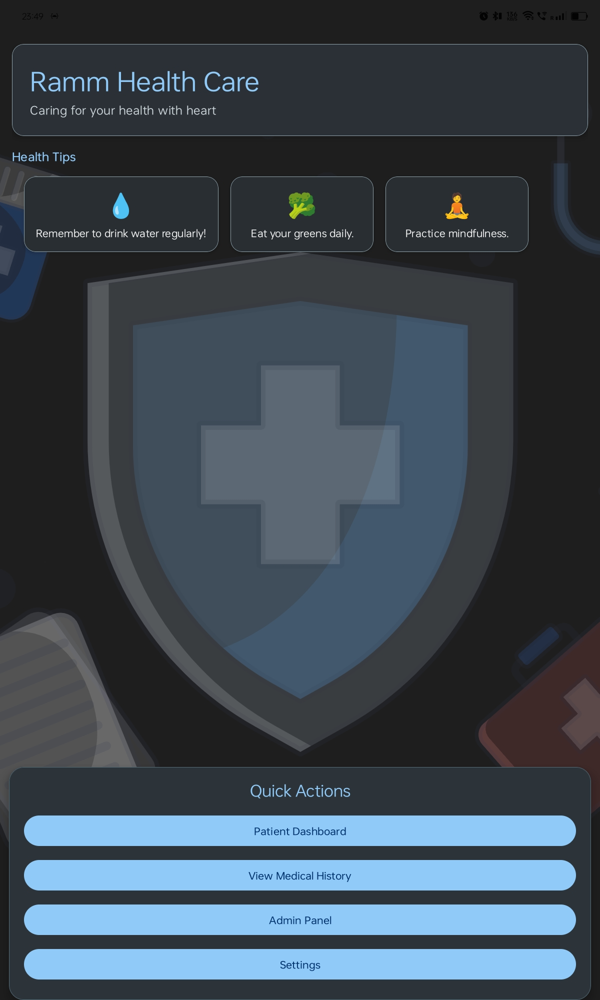
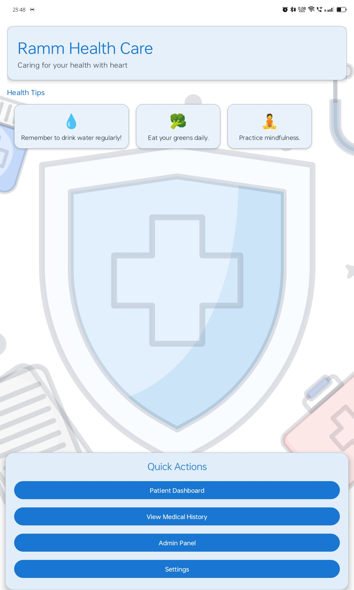
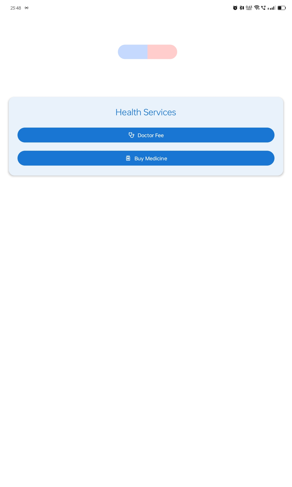
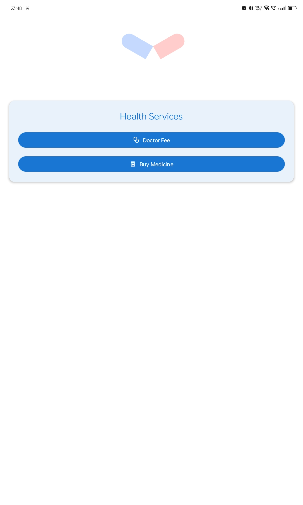
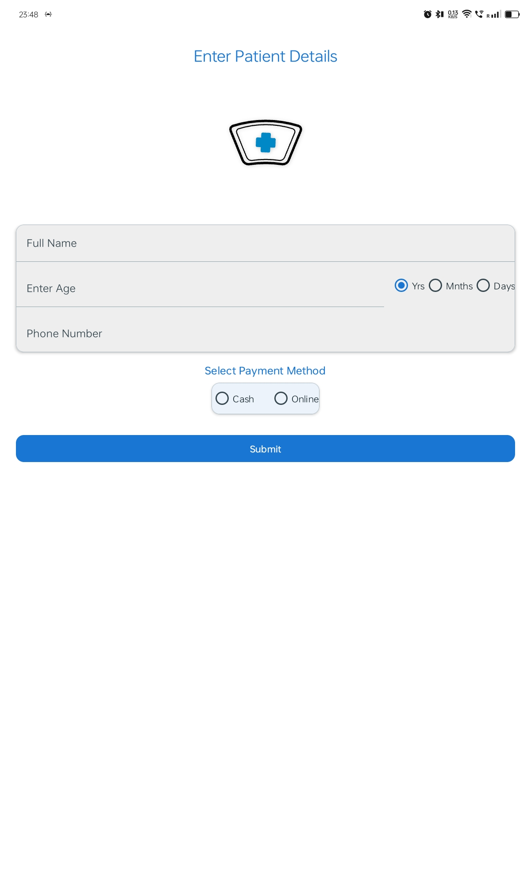
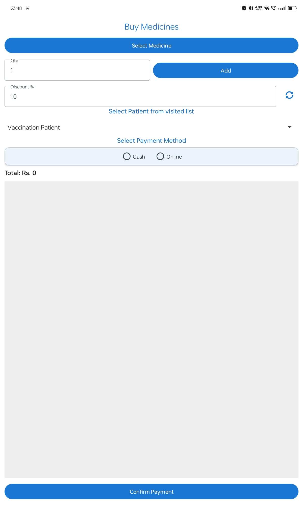
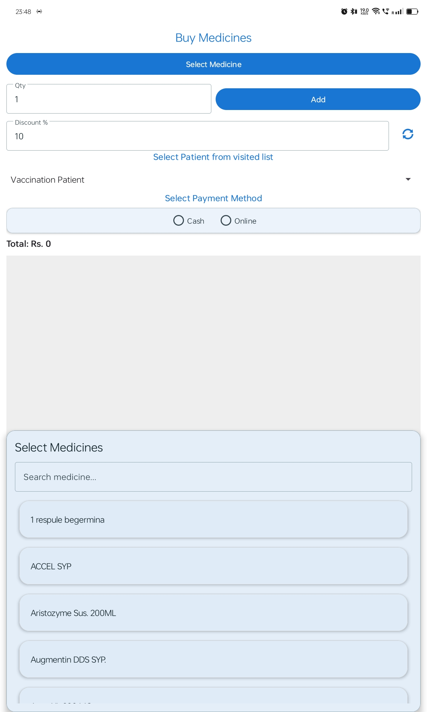
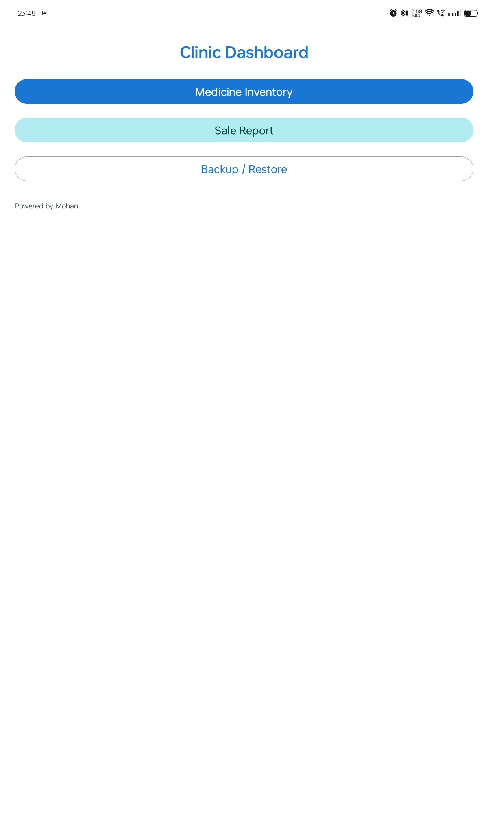
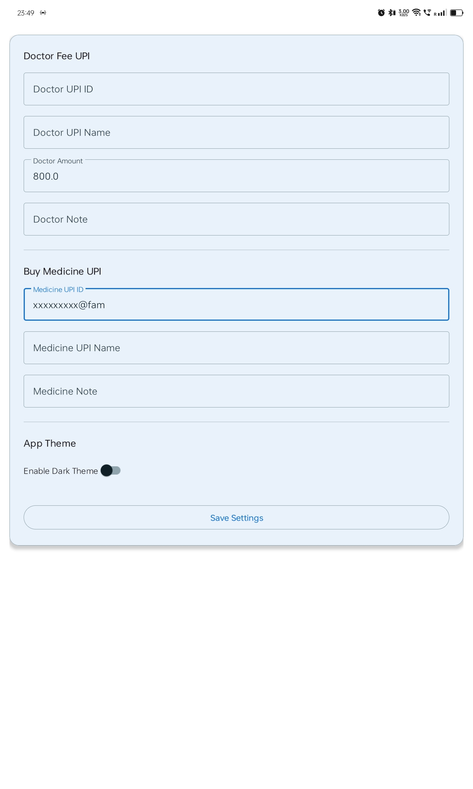

<h1 align="center">🏥 Ramm Healthcare – Smart Clinic Management App</h1>

<em>A modern, offline-first clinic management app built with Material You (Material 3) design – for Indian doctors and small clinics.</em>

---

## 🚀 Features

### 🧑‍⚕️ Patient Visit Management
- Add/update patient details: name, age (Y/M/D), and visit date.
- Track payment mode: Cash / UPI / Online.
- Auto-formatted visit history view.
- Long press any visit to **Edit/Delete** full patient data.

### 💊 Medicine Billing System
- Dynamic medicine picker dialog with search.
- Add multiple medicines with:
  - Quantity
  - Price per unit
  - Discount (%)
  - Final amount auto-calculated
- Live medicine cart preview with delete support.
- Grand total auto-calculated with payment mode selection.

### 📚 Visit History & Filters
- Clean **CardView** display for visits.
- Filter by:
  - 📅 Date Range
  - 🔍 Keyword search (name, age, phone, amount)
- Full patient + medicine summary in one screen.

### 🖋 Editable Record Dialogs
- Long-press to edit:
  - Name, Age, Visit Date, Payment Mode
  - Medicine list, quantity, discounts
- Rounded, Material 3-styled dialogs with scroll and autofill.

### 🧾 📤 Export to PDF (NEW!)
- Export full visit and medicine bill records as **PDF**.
- Print-friendly format.
- Works fully offline – no cloud storage needed.

### 🎨 Material You UI (Material 3)
- Rounded components, clean layout.
- Light/Dark mode support.
- Responsive design for all screen sizes.

### ⚙ Intelligent UX
- Live calculation on quantity/discount change.
- Dynamic search UI.
- Validations on inputs.
- Smart defaults for faster entry.

### 🔐 Privacy & Offline-first
- 100% local data via **SQLite**
- No Internet required.
- No cloud, full privacy – ideal for rural clinics.

---

## 📸 Screenshots

  
  
  

  
  
  

  
  
  

---

## 🧩 Tech Stack

| Technology         | Purpose                        |
|--------------------|--------------------------------|
| Java               | Core application logic         |
| SQLite             | Local data storage             |
| SharedPreferences  | Configuration flags & storage  |
| Material 3 (MDC)   | UI components & themes         |
| RecyclerView       | Dynamic medicine list          |
| BottomSheetDialog  | Medicine selection modal       |
| Dialogs & Alerts   | Edits and confirmations        |
| CardView           | Visit card layout              |
| Lottie (Optional)  | Animations                     |

---

## 🔮 Upcoming Features

- 🗃 Export to **Excel**
- ☁️ Backup/Restore (local & cloud)
- 📈 Visit analytics dashboard
- 👨‍⚕️ Multi-user login (Doctor/Staff mode)
- 🔄 Google Drive/Firebase sync
- 📱 Tablet optimization & RTL support

---

## 🏗 How to Build

1. Clone or download this repository.
2. Open the project in **Android Studio** (or any compatible Java IDE).
3. Ensure `compileSdk` and `targetSdk` are **API 23+ (Android 6.0 or above)**.
4. Click **Build → Build APK(s)** and install on your Android device.

---

## 👨‍🔬 Developer Info

**👨‍💻 Author**: *Ramm Healthcare Dev Team*  
**📌 Mission**: Empower clinics with fast, simple, and fully offline management software tailored for India’s local healthcare practices.

> 💡 *This app stores everything securely on your device — no internet required. 100% privacy, zero data sharing.*

---